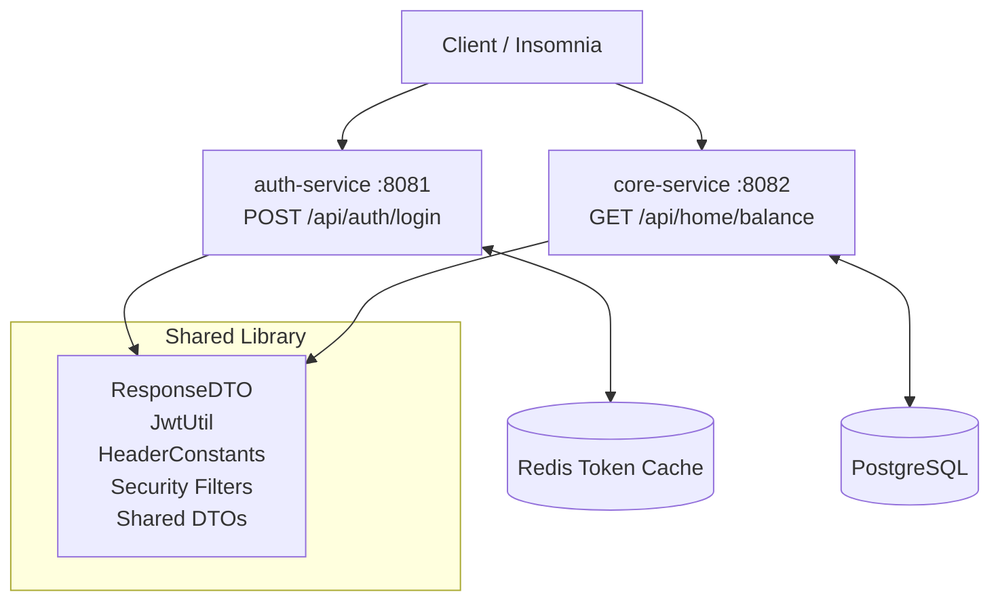
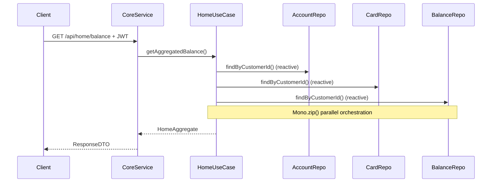

# CoreBank Microservices – Phase 2

**Engineering Requirements Document (ERD)**  
**corebank-microservices-java**  
**Phase 2 – Microservices Migration (Java)**

**Document Version:** 1.0  
**Last Updated:** May 06, 2026  
**Status:** Active  
**Project Series:** CoreBank Modernization Journey

---

## 1. Executive Summary

The `corebank-microservices-java` project is the **first evolutionary step** in the CoreBank Modernization Journey: a realistic, incremental migration of the Phase 1 legacy monolith into a production-grade microservices architecture using the **Strangler Fig Pattern**.

From a single tightly-coupled Spring Boot application, we now have:
- Two independently deployable microservices (`auth-service` + `core-service`)
- A shared `banking-commons` library (extracted common concerns)
- Full **Hexagonal Architecture (Ports & Adapters)** + **DDD bounded contexts** per service
- Secure, header-driven inter-service communication
- **Reactive orchestration** (`Mono.zip()`) and **resilience patterns** (Resilience4j) in the core domain

---

## 2. Architecture

### High-Level Flow


### Hexagonal Architecture (per service)
```
domain/         → Entities, Value Objects (pure business logic)
application/    → Use cases (ports: input + output)
infrastructure/ → Adapters (web controllers, persistence, config)
```

### Reactive Orchestration (core-service)


---

## 3. Technical Stack

| Category                  | Technology                              | Version       | Service                          |
|---------------------------|-----------------------------------------|---------------|----------------------------------|
| Language                  | Java                                    | 21            | All modules                      |
| Framework                 | Spring Boot                             | **4.0.6**     | All modules                      |
| Build                     | Gradle (Kotlin DSL)                     | 8.13+         | Multi-module root                |
| Architecture              | Hexagonal + DDD                         | -             | Both services                    |
| Web (auth)                | Spring MVC                              | -             | auth-service                     |
| Web (core)                | Spring WebFlux                          | -             | core-service (reactive)          |
| Security                  | Spring Security + JJWT                  | 0.12.6        | Both + commons                   |
| Resilience                | Resilience4j (Circuit Breaker + Retry)  | latest        | core-service                     |
| Database                  | PostgreSQL + Spring Data JPA            | -             | core-service                     |
| Cache                     | Redis + Spring Data Redis               | -             | auth-service                     |
| Reactive                  | Project Reactor (Mono.zip)              | -             | core-service orchestration       |
| Shared Library            | banking-commons                         | -             | Common DTOs, security, utils     |
| Container                 | Docker + Docker Compose                 | -             | Full ecosystem                   |
| Testing                   | JUnit 5 + Mockito + StepVerifier        | -             | ≥80% JaCoCo per module           |

---

## 4. Project Structure

```
corebank-microservices-java/
├── banking-commons/                      # Shared library
│   └── src/main/java/com/corebank/commons/
│       ├── model/ResponseDTO.java
│       ├── dto/{LoginRequestDTO,AccountDTO,CardDTO,BalanceDTO,HomeAggregateDTO}
│       ├── security/{JwtUtil,HeaderConstants,BankingSecurityFilter,ReactiveJwtFilter}
│       └── exception/GlobalExceptionHandler.java
├── auth-service/                         # Authentication bounded context (MVC)
│   └── src/main/java/com/corebank/auth/
│       ├── domain/model/{AuthToken,Credentials}
│       ├── application/port/input/AuthenticateUseCase
│       ├── application/port/output/TokenCachePort
│       ├── application/service/AuthApplicationService
│       └── infrastructure/adapter/{web/AuthController,persistence/RedisTokenCacheAdapter}
├── core-service/                         # Product/Home bounded context (WebFlux)
│   └── src/main/java/com/corebank/core/
│       ├── domain/model/{Account,Card,Balance,HomeAggregate}
│       ├── application/port/input/GetHomeBalanceUseCase
│       ├── application/port/output/{AccountRepositoryPort,CardRepositoryPort,BalanceRepositoryPort}
│       ├── application/service/HomeApplicationService
│       └── infrastructure/adapter/{web/HomeController,persistence/*Adapter}
├── docker-compose.yml
├── build.gradle.kts
└── settings.gradle.kts
```

---

## 5. API Endpoints (Identical Contract to Phase 1)

| Endpoint              | Service        | Method | Description                  | Required Headers                      |
|-----------------------|----------------|--------|------------------------------|---------------------------------------|
| `/api/auth/login`     | auth-service   | POST   | Authenticate + issue JWT     | `X-CustIdentNum`, `X-CustIdentType`  |
| `/api/home/balance`   | core-service   | GET    | Aggregated homepage data     | All banking headers + `Authorization` |
| `/actuator/health`    | both           | GET    | Health check                 | -                                     |

**Response Format** (from `banking-commons`):
```json
{
  "statusCode": 200,
  "body": { ... },
  "extraArgs": { ... }
}
```

---

## 6. How to Run

### Prerequisites
- Java 21
- Docker & Docker Compose

### Start Infrastructure
```bash
docker compose up -d   # Postgres + Redis
```

### Build & Run
```bash
./gradlew clean build

# In separate terminals:
./gradlew :auth-service:bootRun
./gradlew :core-service:bootRun
```

### Quick Verification
```bash
# Login (auth-service :8081)
curl -X POST http://localhost:8081/api/auth/login \
  -H "Content-Type: application/json" \
  -H "X-CustIdentNum: 123456789" \
  -H "X-CustIdentType: CC" \
  -d '{"username":"user","password":"password"}'

# Home Balance (core-service :8082 — use token from login)
curl http://localhost:8082/api/home/balance \
  -H "Authorization: Bearer <token>" \
  -H "X-CustIdentNum: 123456789" \
  -H "X-CustIdentType: CC"
```

### Stop
```bash
docker compose down -v
```

---

## 7. Before / After Comparison (Phase 1 → Phase 2)

| Aspect                  | Phase 1 (Monolith)          | Phase 2 (Microservices)                   |
|-------------------------|-----------------------------|-------------------------------------------|
| Architecture            | Layered (Controller→Svc→Repo) | Hexagonal + DDD per service             |
| Deployment              | Single JAR                  | 2 independent services + shared lib       |
| Web Framework           | Spring MVC (blocking)       | MVC (auth) + WebFlux (core)               |
| Data Orchestration      | Synchronous, sequential     | Reactive `Mono.zip()` (parallel)          |
| Resilience              | None                        | Resilience4j (Circuit Breaker + Retry)    |
| Shared Code             | Everything coupled          | Extracted to `banking-commons`            |
| Testability             | Coupled tests               | Per-layer tests (domain, app, infra)      |
| Scalability             | Scale entire app            | Scale each service independently          |
| External Contract       | `ResponseDTO` on :8080      | **Identical** `ResponseDTO` on :8081/:8082|

---

## 8. Testing

**Coverage Target**: ≥80% JaCoCo per module

```bash
./gradlew clean build jacocoTestReport
```

---

> This project is not a toy — it is a deliberate, production-inspired demonstration of the exact modernization journey used in enterprise fintech at VCSoft/Davivienda.
>
> All phases use **Spring Boot 4.0.6 + Java 21** while demonstrating progressive architectural improvement.
